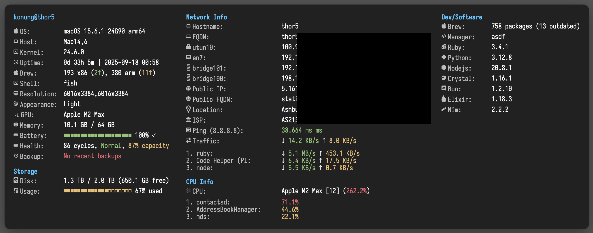

# SystemInfoWidget for Übersicht

**Version 3.7.0**

A comprehensive system monitoring widget for [Übersicht](http://tracesof.net/uebersicht/) that displays detailed system information on your macOS desktop.


*Sample screenshot from my desktop (IP/Network Volume info redacted)*

## Features

### System Information
- OS version and kernel details
- Hostname and username
- Uptime tracking
- Shell and terminal detection
- Desktop environment info

### Hardware Monitoring
- Memory usage with percentage
- GPU information
- Display resolution

### Network Monitoring
- All network interfaces with IPs
- WiFi SSID display
- Public IP with location
- Network traffic rates (up/down)
- **Live app network usage** - See which apps are using bandwidth
- Ping latency monitoring
- VPN/Tailscale detection

### Storage Information
- APFS-accurate disk usage
- Available space tracking
- Visual percentage indicator

### Package Management
- Dual Homebrew support (Intel & ARM)
- Package counts (brew, cask, npm, pip)
- Outdated package tracking with caching

### Developer Tools
- Dynamic language version detection via asdf
- Automatically detects all installed asdf plugins
- Configurable language display list
- Support for 18+ programming languages

### CPU Information
- CPU model with thread count and usage
- Real-time CPU usage percentage
- Top CPU-consuming processes
- Color-coded usage indicators

### Power Management
- Battery percentage and charging status
- Battery health metrics (cycles, condition, max capacity)

### Backup Monitoring
- Time Machine backup status
- Live backup progress indicator
- Last backup date and time (ISO format)
- Backup destination display

### Architecture

### Version 3.0+ Structure
The widget now features a fully modular architecture:

```
SystemInfoWidget.widget/
├── index.coffee           # Main widget file (configuration and orchestration)
├── system-info.sh        # Main data collection script
└── lib/                 # All modules (Übersicht ignores /lib directory)
    ├── ui-modules/      # CoffeeScript modules for UI rendering
    │   ├── helpers.coffee    # Shared UI utilities
    │   ├── system-renderer.coffee
    │   ├── network-renderer.coffee
    │   ├── storage-renderer.coffee
    │   ├── cpu-renderer.coffee
    │   ├── dev-renderer.coffee
    │   └── logo-renderer.coffee
    └── shell-modules/   # Bash modules for system data collection
        ├── core.sh      # Utility functions and caching
        ├── system.sh    # System and hardware info
        ├── network.sh   # Network interfaces and traffic
        ├── packages.sh  # Package managers (brew, npm, pip)
        ├── storage.sh   # Disk usage with APFS support
        ├── battery.sh   # Battery and Time Machine status
        └── processes.sh # CPU processes monitoring
```

### Shell Module Architecture (v2.0+)
- Complete modularization - Split monolithic script into focused modules
- Parallel execution for 71% performance improvement
- Each module can be updated independently

### Enhanced Features
- Dynamic asdf language detection - no hardcoded language list
- Improved battery status (Charging/Charged/Discharging states)
- Fixed all major bugs from v1.2
- JSON-based cache to prevent duplicate keys

## Installation

Installing this widget is super easy! Just follow the steps below:

### Step 1: Install Übersicht
First, you need the Übersicht app itself:
```bash
brew install --cask ubersicht
```
Or download from [http://tracesof.net/uebersicht/](http://tracesof.net/uebersicht/)

### Step 2: Install Required Dependencies
Install all required tools with one command:
```bash
# Install required tools (jq) and recommended font
brew install jq && \
brew tap homebrew/cask-fonts && \
brew install --cask font-iosevka-term-nerd-font
```

### Step 3: Install the Widget

#### Option A: Via Git (Recommended)
```bash
cd ~/Library/Application\ Support/Übersicht/widgets/
git clone https://github.com/konung/ubersicht-SystemInfoWidget.git SystemInfoWidget.widget
```

#### Option B: Manual Download
1. Download the latest release from [GitHub](https://github.com/konung/ubersicht-SystemInfoWidget/releases)
2. Move the downloaded folder to `~/Library/Application Support/Übersicht/widgets/`
3. Rename the folder to `SystemInfoWidget.widget` if needed

### Step 4: Configure the Font in Übersicht
1. Open Übersicht preferences (click the Übersicht icon in menu bar → Preferences)
2. Under "General" tab, set the font to **IosevkaTerm Nerd Font Mono**
3. Adjust font size if needed (recommended: 13-15px)

### Step 5: Refresh and Position
1. Refresh Übersicht (menu bar → Refresh All Widgets)
2. The widget should appear in the top-left corner
3. To adjust position, edit `index.coffee`:
   ```coffee
   position:
     top: 20    # Distance from top
     left: 20   # Distance from left
   ```

### Quick Install Script
For the lazy developers, here's a one-liner that does everything:
```bash
brew install --cask ubersicht && \
brew install jq && \
brew tap homebrew/cask-fonts && \
brew install --cask font-iosevka-term-nerd-font && \
cd ~/Library/Application\ Support/Übersicht/widgets/ && \
git clone https://github.com/konung/ubersicht-SystemInfoWidget.git SystemInfoWidget.widget && \
open -a Übersicht
```

### Verify Installation
After installation, you should see:
- System information with icons (not boxes or `?` characters)
- Real-time updates every 5 seconds
- Network traffic monitoring with app names

If icons appear as boxes, double-check that IosevkaTerm Nerd Font is selected in Übersicht preferences.

## Widget Layout

The widget is organized into multiple sections across columns:

### Column 1 - System & Storage
- **System Info**: OS version, uptime, shell, terminal
- **Storage**: Disk usage with visual progress bar
- **Summary**: Total packages, processes, threads

### Column 2 - Network & CPU
- **Network Info**: Interfaces, IPs, traffic rates
- **Network Apps**: Top apps by current bandwidth usage
- **CPU Info**: CPU model, usage, top processes

### Column 3 - Development
- **Dev/Software**: Package managers, language versions
- **Version Manager**: asdf/rbenv/nvm detection

### Additional Features
- **Battery Health**: Displayed in System Info when on battery
- **Time Machine**: Shows backup progress when active
- **Nerd Font Icons**: Used throughout for visual clarity

## Configuration

Edit `index.coffee` to customize the widget:

### Position
```coffee
position:
  top: 20     # Distance from top
  left: 20    # Distance from left
```

### Display Options
```coffee
display:
  showLogo: false         # ASCII art logo
  showSystemInfo: true    # System details
  showNetwork: true       # Network info & CPU info
  showStorage: true       # Disk usage
  showBattery: true       # Battery status & health
  showDev: true           # Developer tools & languages
  showLanguages: true     # Programming language versions
  showNetworkApps: true   # Per-app network traffic
  showDebugFooter: false  # Debug footer with timing info (for development)
  networkAppsCount: 3     # Number of network apps (1-5)
```

### Network App Filtering
```coffee
skipNetworkApps: [
  'kernel_task'
  'IPNExtension'
  'mDNSResponder'
  # Add more apps to exclude
]
```

### Appearance
```coffee
appearance:
  backgroundOpacity: 0.85
  backgroundBlur: 10
  borderRadius: 13
  fontSize: 15
  iconFontSize: 18
```

## Requirements

### System Requirements
- macOS 10.14 or later
- [Übersicht](http://tracesof.net/uebersicht/) (widget platform)

### Required Tools
These must be installed for the widget to function:

| Tool | Purpose | Installation |
|------|---------|-------------|
| `jq` | JSON processing | `brew install jq` |
| `curl` | IP geolocation | Pre-installed on macOS |
| `bc` | Math calculations | Pre-installed on macOS |
| `nettop` | Per-app network monitoring | Pre-installed on macOS |
| `tmutil` | Time Machine status | Pre-installed on macOS |

### Optional but Recommended
- **Nerd Fonts** - For proper icon display (recommended: [IosevkaTerm Nerd Font](https://www.nerdfonts.com/))
  - Without Nerd Fonts, icons will appear as boxes or missing characters
  - Install via Homebrew: `brew tap homebrew/cask-fonts && brew install --cask font-iosevka-term-nerd-font`

### Built-in macOS Tools Used
The widget uses these pre-installed macOS tools:
- **System**: `sw_vers`, `sysctl`, `scutil`, `system_profiler`, `uptime`, `defaults`
- **Network**: `ifconfig`, `networksetup`, `netstat`, `nettop`, `ping`, `route`, `nslookup`
- **Storage**: `diskutil` (for APFS-accurate readings), `df` (fallback)
- **Power**: `pmset` (battery status)
- **Text Processing**: `awk`, `sed`, `grep`, `cut`, `sort`, etc.

### Optional Tool Detection
The widget automatically detects and uses if present:
- **Package Managers**: `brew`, `npm`, `pip`/`pip3`
- **Version Managers**: `asdf`, `rbenv`, `nvm`, `pyenv`
- **Languages**: `ruby`, `node`, `python`, `crystal`, `elixir`, `rust`, `go`, `java`
- **Enhanced Tools**:
  - `gping` - Better ping statistics (`brew install gping`)

## Features in Detail

### Smart Caching
- Brew outdated packages cached for 1 hour
- IP location cached intelligently (see Rate Limiting below)
- Network traffic tracked continuously

### Rate Limiting & IP Monitoring

The widget implements intelligent caching to avoid hitting API rate limits:

#### How It Works
1. **Initial Check**: When the widget starts, it fetches full IP info (location, ISP, hostname)
2. **Smart Refresh**:
   - Every **5 minutes**: Quick IP-only check to detect changes
   - If IP changed: Full info refresh triggered immediately
   - If IP unchanged: Cached data continues to be used
3. **Full Refresh**: Every **1 hour** regardless of IP changes

#### API Services Used
- Primary: `ipinfo.io` (limited to ~1000 requests/day without token)
- Fallback services if rate limited:
  - `api.ipify.org` (IP only)
  - `checkip.amazonaws.com` (IP only)
  - `icanhazip.com` (IP only)

#### Cache Location
- Stored in `.cache` file in widget directory
- Format: Simple key=value pairs
- Automatically cleaned up on each update

#### If You Hit Rate Limits
- The widget will still show your local network info
- Public IP will fall back to IP-only services (no location data)
- Wait 1 hour for automatic cache expiry
- Or manually delete `.cache` file to force refresh

### Dual Homebrew Support
Automatically detects and monitors both:
- Intel Homebrew at `/usr/local/bin/brew`
- ARM Homebrew at `/opt/homebrew/bin/brew`

### Real-time Network Traffic

#### Overall Traffic Monitoring
- Uses `netstat` to track total network bytes
- Calculates rates by comparing samples over time
- Updates every 5 seconds (configurable via `refreshFrequency`)
- Shows human-readable rates (KB/s, MB/s, etc.)

#### Per-App Bandwidth Monitoring
- Uses `nettop` to capture app-level network usage
- Takes two samples 1 second apart to calculate rates
- Shows top N apps by current bandwidth usage (default: 3)
- Filters out system processes by default

#### Configurable Filtering
```coffee
skipNetworkApps: [
  'kernel_task'      # System kernel
  'IPNExtension'     # Some VPN extensions
  'mDNSResponder'    # Bonjour/DNS
  'trustd'           # Certificate validation
  'nsurlsessiond'    # Background downloads
]
```

#### How Network Monitoring Works
1. **Total Traffic**: Tracked via `netstat -b` interface statistics
2. **App Traffic**: Sampled via `nettop -P` process monitoring
3. **Rate Calculation**: (Current Bytes - Previous Bytes) / Time Elapsed
4. **Display**: Only shows apps actively transferring data

## Customization

### Adding Programming Languages
Edit the `languages` array in `index.coffee`:
```coffee
languages: [
  'ruby'
  'nodejs'
  'python'
  'rust'
  'go'
  # Add more as needed
]
```

### Changing Icons
The widget uses Nerd Font icons. You can customize them in the `icons` section:
```coffee
icons:
  os: ''        # Apple logo
  cpu: ''       # CPU icon
  memory: '󰍛'    # RAM icon
  # ... more icons
```

## Troubleshooting

### Widget not displaying
- Check that Übersicht is running (Restart if needed)
- Verify the widget is in the correct directory
- Check Console for error/debug messages

### Missing icons
- Install a Nerd Font (recommended: IosevkaTerm Nerd Font)
- Set the font in Übersicht preferences - Most Nerd fonts should work

### Network apps not showing
- The widget uses `nettop` for per-app bandwidth monitoring
- `nettop` doesn't require special permissions for basic functionality
- Only actively transferring apps will appear in the list
- System processes can be filtered via `skipNetworkApps` configuration

### Permission Issues
- If you see permission errors, the widget will still function but some features may be limited
- Network traffic totals will always work as they use `netstat` which doesn't require special permissions

## License

MIT License - feel free to modify and distribute

## Contributing

Pull requests are welcome! Please feel free to submit issues or improvements.

## Development Tools

- [Claude Code](https://claude.ai/code) was used to help understand Übersicht's documentation, documentation of several CLI tools and debug compatibility/module loading  issues during the v3.x refactoring.

## Credits

- Inspired by Übersicht widgets NetFullSysInfo and neofetch
