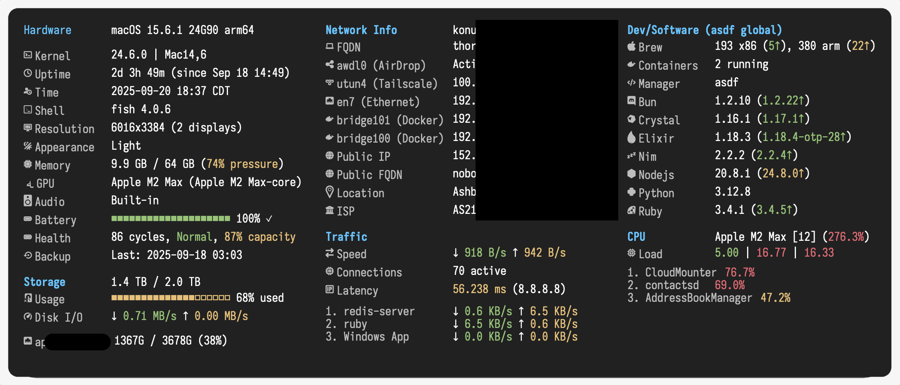

# SystemInfoWidget for Übersicht

A comprehensive system monitoring widget for [Übersicht](http://tracesof.net/uebersicht/) that displays detailed system information on your macOS desktop.



## Features

### System Information
- OS version and kernel details
- Hostname and username
- Uptime tracking
- Shell and terminal detection
- Desktop environment info

### Hardware Monitoring
- CPU model with thread count
- Real-time CPU usage
- Memory usage with percentage
- GPU information
- Display resolution

### Network Monitoring
- All network interfaces with IPs
- WiFi SSID display
- Public IP with location
- Network traffic rates (up/down)
- **Live app network usage** - See which apps are using bandwidth
- Ping latency monitoring
- VPN/Tailscale detection

### Storage Information
- APFS-accurate disk usage
- Available space tracking
- Visual percentage indicator

### Package Management
- Dual Homebrew support (Intel & ARM)
- Package counts (brew, cask, npm, pip)
- Outdated package tracking with caching

### Developer Tools
- Programming language versions (Ruby, Node.js, Python, etc.)
- Version manager detection (asdf, rbenv, nvm)
- Configurable language display

### Power Management
- Battery percentage
- Charging status indicator

## Installation

1. Install [Übersicht](http://tracesof.net/uebersicht/)

2. Clone this widget to your widgets folder:
```bash
cd ~/Library/Application\ Support/Übersicht/widgets/
git clone https://github.com/konung/ubersicht-SystemInfoWidget.git SystemInfoWidget.widget
```

3. Refresh Übersicht to see the widget

## Configuration

Edit `index.coffee` to customize the widget:

### Position
```coffee
position:
  top: 20     # Distance from top
  left: 20    # Distance from left
```

### Display Options
```coffee
display:
  showLogo: false         # ASCII art logo
  showSystemInfo: true    # System details
  showHardware: true      # CPU/Memory
  showNetwork: true       # Network info
  showStorage: true       # Disk usage
  showBattery: true       # Battery status
  showLanguages: true     # Dev languages
  showNetworkApps: true   # App traffic monitoring
  networkAppsCount: 3     # Number of apps to show
```

### Network App Filtering
```coffee
skipNetworkApps: [
  'kernel_task'
  'IPNExtension'
  'mDNSResponder'
  # Add more apps to exclude
]
```

### Appearance
```coffee
appearance:
  backgroundOpacity: 0.85
  backgroundBlur: 10
  borderRadius: 13
  fontSize: 15
  iconFontSize: 18
```

## Requirements

- macOS 10.14 or later
- [Übersicht](http://tracesof.net/uebersicht/)
- `jq` for JSON processing (install via `brew install jq`)
- Nerd Fonts for icons (recommended: IosevkaTerm Nerd Font)

## Features in Detail

### Smart Caching
- Brew outdated packages cached for 1 hour
- IP location cached for 5 minutes
- Network traffic tracked continuously

### Dual Homebrew Support
Automatically detects and monitors both:
- Intel Homebrew at `/usr/local/bin/brew`
- ARM Homebrew at `/opt/homebrew/bin/brew`

### Real-time Network Traffic
- Shows current upload/download rates
- Per-app bandwidth monitoring
- Configurable app filtering

## Customization

### Adding Programming Languages
Edit the `languages` array in `index.coffee`:
```coffee
languages: [
  'ruby'
  'nodejs'
  'python'
  'rust'
  'go'
  # Add more as needed
]
```

### Changing Icons
The widget uses Nerd Font icons. You can customize them in the `icons` section:
```coffee
icons:
  os: ''        # Apple logo
  cpu: ''       # CPU icon
  memory: '󰍛'    # RAM icon
  # ... more icons
```

## Troubleshooting

### Widget not displaying
- Check that Übersicht is running
- Verify the widget is in the correct directory
- Check Console.app for error messages

### Missing icons
- Install a Nerd Font (recommended: IosevkaTerm Nerd Font)
- Set the font in Übersicht preferences

### Network apps not showing
- The widget uses `nettop` which requires accessibility permissions
- Some apps may need to be running to appear

## License

MIT License - feel free to modify and distribute

## Contributing

Pull requests are welcome! Please feel free to submit issues or improvements.

## Credits

Inspired by various Übersicht widgets including NetFullSysInfo and neofetch.